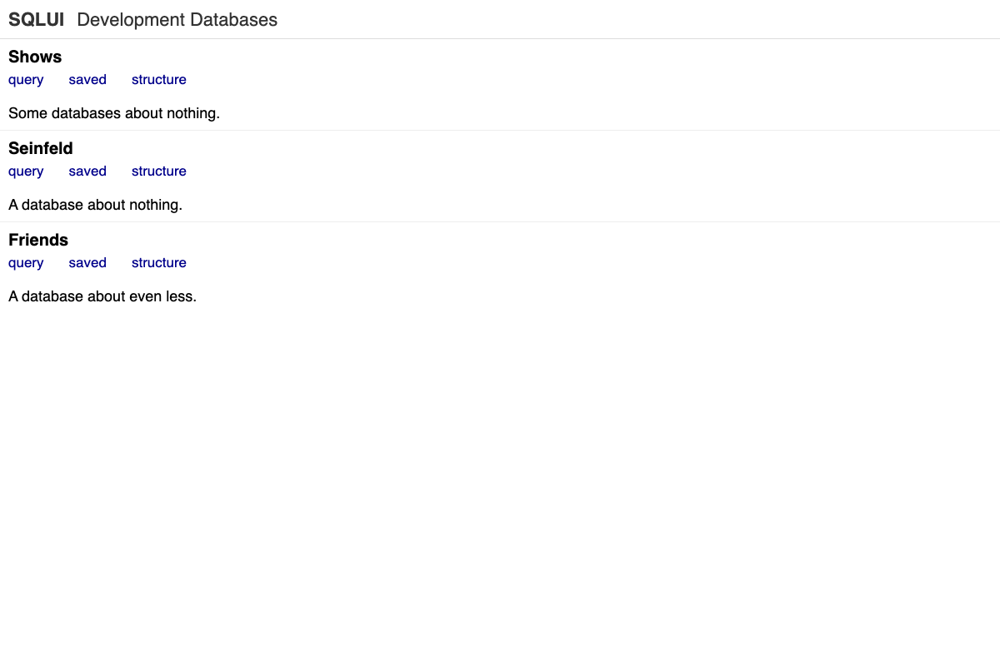
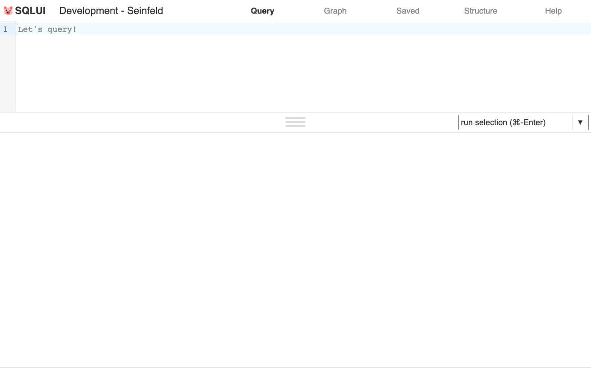
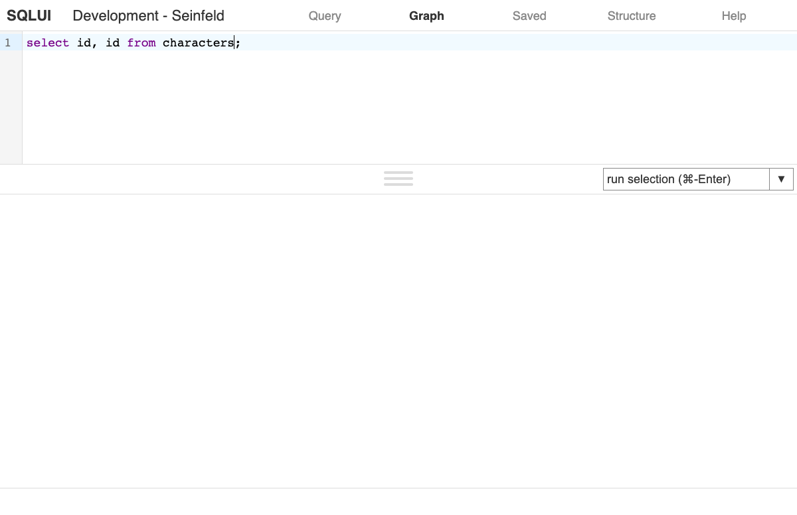
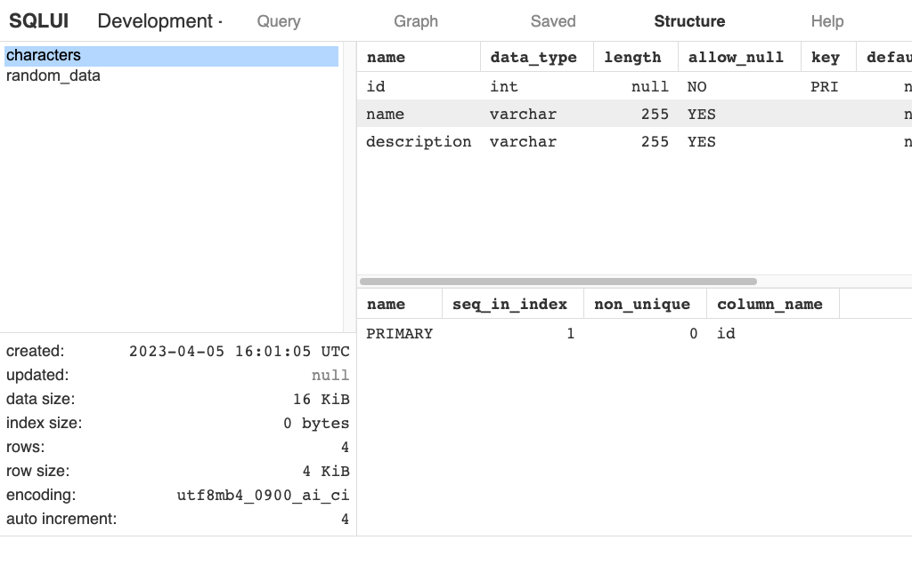
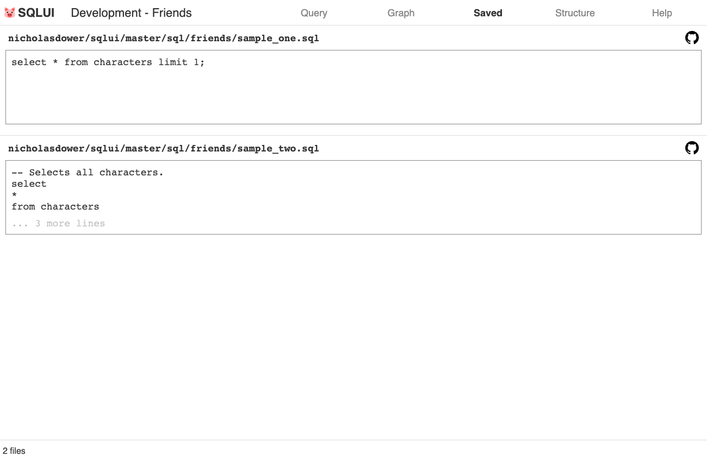
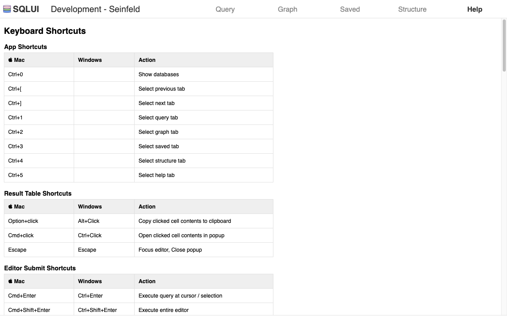

# <picture></img></picture> SQLUI (/ˈskwiːi/)

## Intro

A web app which can be used to query one or more SQL databases.

## Contents

- [Features](#features)
- [Screenshots](#screenshots)
- [Usage](#usage)
- [Development](#development)
  + [Default Setup](#default-setup)
  + [Running The Server & Tests Outside of Docker](#running-the-server--tests-outside-of-docker)

## Features

- Query
  - Execute queries
  - Autocomplete keywords, table names, columns
  - Configure autocomplete of frequently used join statements
  - Configure autocomplete of frequently used table aliases
  - Save to file/clipboard
  - Executing saved queries from GitHub
  - Cell links.
- Graph results (WIP)
- Share queries via URL
- View database details
  - List databases
  - List tables
  - View table stats
  - View column details
  - View index details
- Export metrics to Prometheus (WIP)
- Report errors to Airbrake

## Screenshots

     

## Usage

### Create a config file

See [development_config.yml](https://github.com/nicholasdower/sqlui/blob/master/development_config.yml) for an example.

```yaml
# App Configuration
name:          SQLUI                            # Server display name to be used in the UI.
port:          8080                             # App port.
environment:   development                      # App environment.
base_url_path: /path                            # URL path used as the base for all app URLs.

# Database Configurations
databases:                                      # Map of database configurations.
  seinfeld:                                     # Database configuration name.
    display_name: Seinfeld                      # User-facing name.
    description:  A database about nothing.     # User-facing description.
    url_path:     seinfeld                      # Relative URL path used to access this database.

    # Connection Configuration
    client_params:                              # Params for the MySQL client.
      database: seinfeld                        # Optional database name.
      username: newman                          # Database username.
      password: drakescoffeecake                # Database password.
      port:     3306                            # Database port.
      host:     127.0.0.1                       # Database host.

    # Table Configurations (Optional)
    tables:                                     # Map of table configurations.
      characters:                               # Table name.
        alias: c                                # Default table alias.
        boost: 1                                # Auto-complete boost.
      [...]

    # Column Configurations (Optional)
    columns:                                    # Map of column configurations.
      name:                                     # Column name.
        links:                                  # Optional map of cell links.
          google:                               # Link configuration name.
            short_name: G                       # Link short name. Displayed within the cell.
            long_name:  Google                  # Link long name. Displayed on hover.
            template:   google.com/search?q={*} # Link URL. Use {*} as a placeholder.
          [...]

    # Join Configurations (Optional)
    joins:                                      # Map of join configurations.
      actors_to_charactors:                     # Join configuration name.
        label: 'actors to characters'           # Join label. Displayed in autocomplete dropdown.
        apply: 'actors a ON a.id = c.actor_id'  # Join statement.
      [...]
  [...]
```

### Install the Gem or add it to your `Gemfile`

```shell
gem install 'sqlui'
```

or

```ruby
gem 'sqlui'
```

### Run the gem directly or via bundle if using a Gemfile

```shell
sqlui config-file
```

or

```shell
bundle exec sqlui config-file
```

## Development

### Default Setup

By default all building, running and testing is done in Docker containers.

#### Install Docker

See https://docs.docker.com/get-docker/

#### Start the database and server

```shell
make start
```

Visit http://localhost:8080/sqlui

#### Run the tests

```shell
make test
```

### Running The Server & Tests Outside of Docker

It is also possible to run the server tests without Docker. Docker is still used for MySQL and browser tests.

#### Install rvm (Ruby Version Manager)

See https://rvm.io/rvm/install

#### Install Ruby

```shell
rvm install ruby-3.0.0
rvm use
```

#### Install nvm (Node Version Manager)

See https://github.com/nvm-sh/nvm#installing-and-updating.

#### Install Node

```shell
nvm install 19.0.0
nvm use
```

#### Start the database and server

```shell
make start-local
```

Visit http://localhost:8080/sqlui

#### Install Chromedriver

See https://chromedriver.chromium.org/getting-started

#### Run the tests

```shell
make test-local
```
